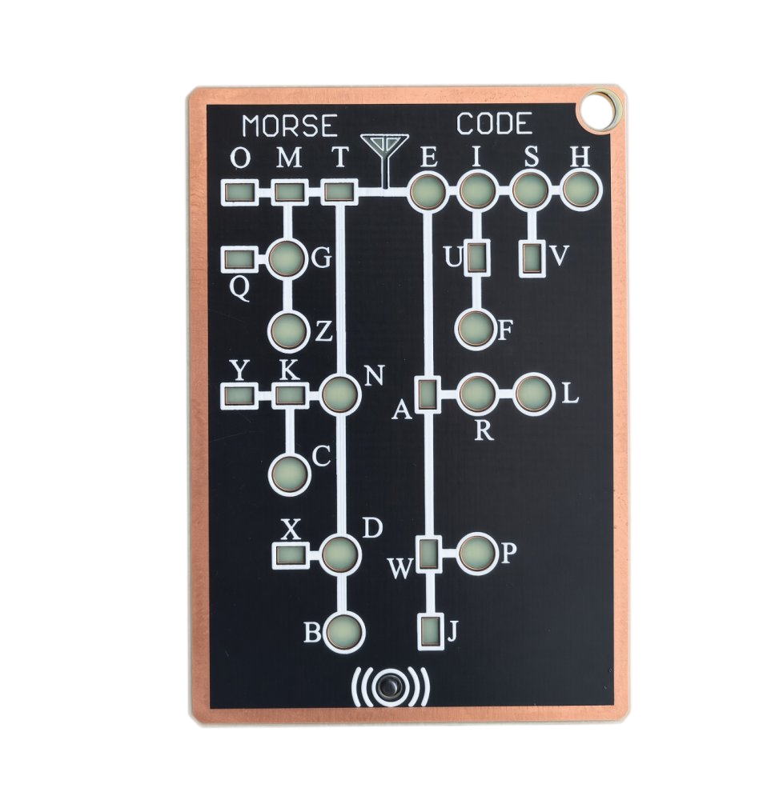

# Morse Code
... .- ... .--. . ...  

  

A compact Bruce app for learning and exploring the Morse code alphabet through a visual, interactive grid.

## Features

- Visual Morse code training grid
- Letter-by-letter navigation and lookup
- Morse symbol preview for each selected character

## Install

### Option 1: Bruce App Store

- Open Bruce App Store via JS Interpreter → Tools → App Store
- If the App Store is not present, go to Config → Install App Store
- Navigate to Tools
- Download and install Morse Code

### Option 2: Manual Install

- Drop `MorseCode.js` onto your Bruce device
- Open the Bruce Interpreter
- Run the script

## Controls

The app uses a simple navigation flow:

- Next / Prev: move horizontally through the grid
- SEL: move down or continue through the path
- ESC: exit the app

At each step, the app highlights the current cell and shows the selected letter and its Morse pattern.

This project is inspired by the Morse Code Trainer Card Pro and follows the same hands-on learning approach to make Morse code easier to understand and remember.
